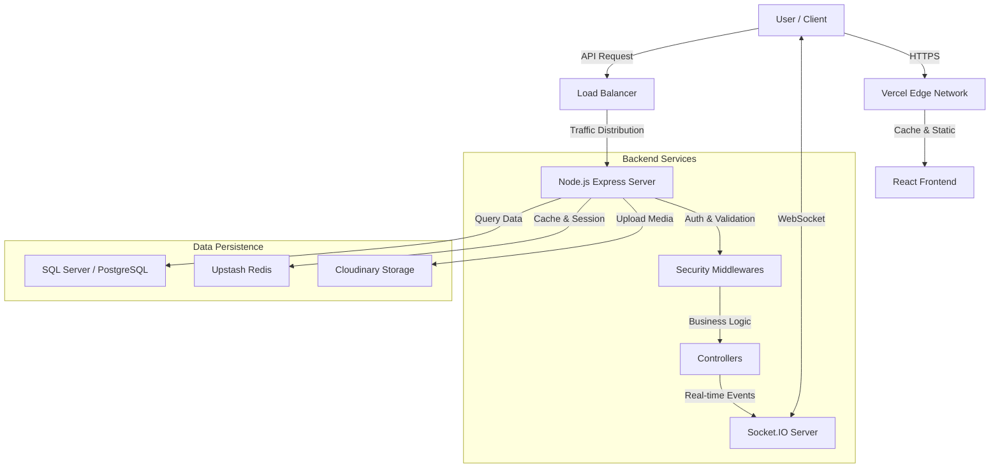
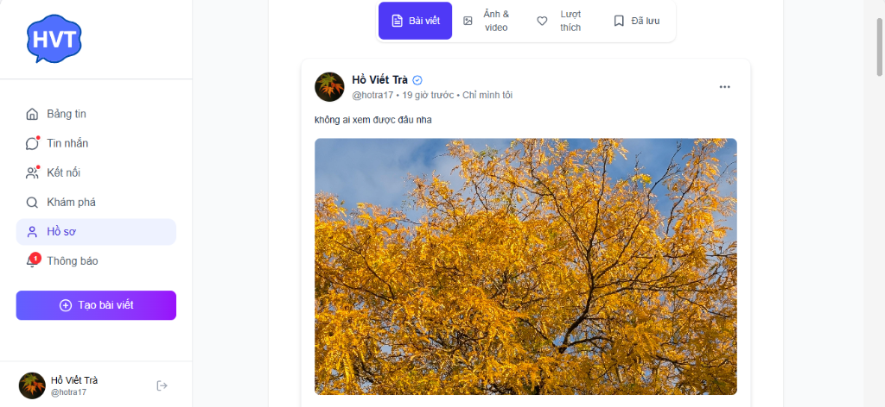
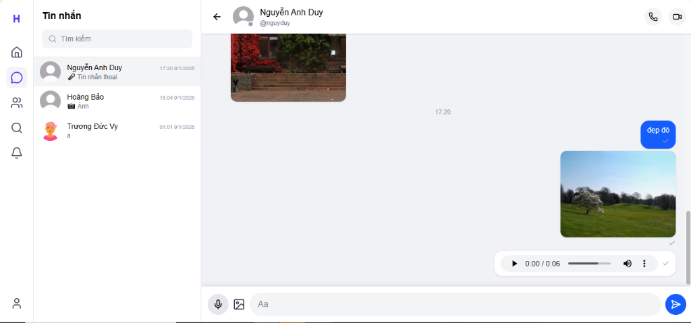
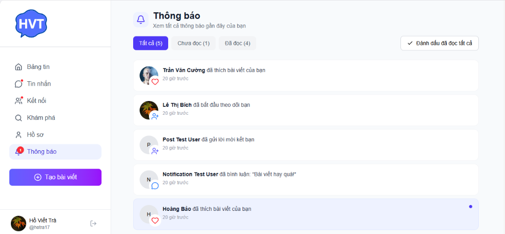
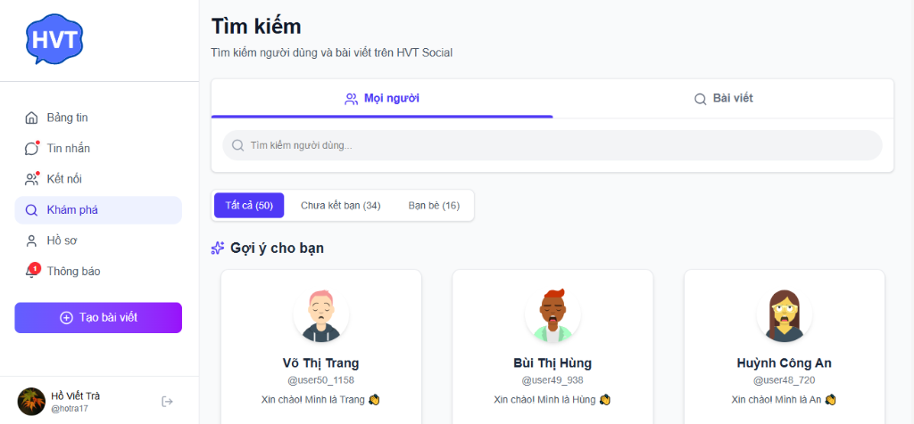
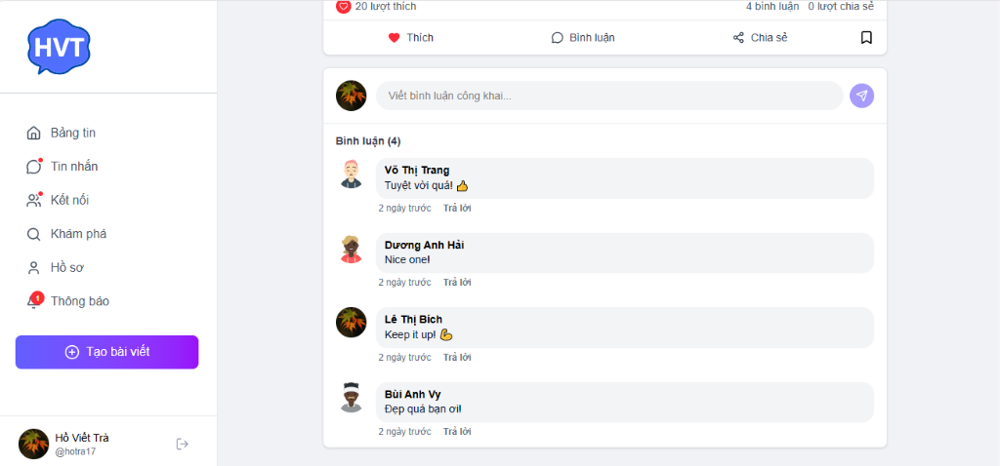

# 🌐 HVTSocial - Mạng Xã Hội Kết Nối

[](https://github.com/HoTra171/HVTSocial)
[](https://hvt-social.vercel.app)
[](https://nodejs.org/)
[](https://react.dev/)

**HVTSocial** là một nền tảng mạng xã hội hiện đại, đầy đủ tính năng, được xây dựng như một đồ án tốt nghiệp chuyên sâu. Dự án tập trung vào trải nghiệm người dùng mượt mà, khả năng tương tác thời gian thực và kiến trúc hệ thống mở rộng.

> 🎓 **Đồ Án Tốt Nghiệp** | Phát triển bởi **Hồ Việt Trà**

---

## ✨ Tính Năng Nổi Bật

### 🚀 Trải Nghiệm Người Dùng (Social Core)
*   **Bảng Tin Thông Minh**: Cuộn vô hạn (Infinite Scroll), hiển thị bài viết đa phương tiện (ảnh, video).
*   **Stories 24h**: Chia sẻ khoảnh khắc ngắn hạn, tự động biến mất sau 24 giờ.
*   **Tương Tác**: Thích (Like), Bình luận (Comment) đa cấp, Chia sẻ bài viết.
*   **Kết Nối**: Gửi, chấp nhận/từ chối lời mời kết bạn, quản lý danh sách bạn bè.

### 💬 Giao Tiếp Thời Gian Thực (Real-time)
*   **Nhắn Tin**: Chat 1-1, gửi tin nhắn văn bản, hình ảnh, file.
*   **Thông Báo Tức Thì**: Nhận thông báo (Notification) ngay lập tức khi có tương tác mới.
*   **Trạng Thái Online**: Biết khi nào bạn bè đang hoạt động.
*   **Video Call**: Gọi video chất lượng cao sử dụng WebRTC (Peer-to-Peer).

### 🛡️ Bảo Mật & Quản Lý
*   **Xác Thực An Toàn**: Đăng nhập/Đăng ký bảo mật với JWT (Access + Refresh Tokens).
*   **Phân Quyền (RBAC)**: Hệ thống phân quyền chi tiết cho Admin và User.
*   **Bảo Vệ Dữ Liệu**: Mã hóa mật khẩu, chống SQL Injection, XSS, CSRF.

---

## 🛠️ Công Nghệ Sử Dụng

Dự án sử dụng các công nghệ mới nhất để đảm bảo hiệu suất và khả năng bảo trì.

### Frontend (Client-side)
*   **Core**: [React 19](https://react.dev/) - Thư viện UI mới nhất.
*   **Build Tool**: [Vite](https://vitejs.dev/) - Tốc độ build siêu nhanh.
*   **Styling**: [Tailwind CSS v4](https://tailwindcss.com/) - Thiết kế giao diện hiện đại, responsive.
*   **State Management**: React Context API & Hooks.
*   **Real-time**: Socket.IO Client.
*   **Routing**: React Router DOM v7.

### Backend (Server-side)
*   **Runtime**: [Node.js](https://nodejs.org/) (JavaScript Runtime).
*   **Framework**: [Express.js](https://expressjs.com/) - Robust API Framework.
*   **Database**:
    *   **SQL Server** (Dev): Database chính cho phát triển.
    *   **PostgreSQL** (Prod): Database tối ưu cho môi trường Production (Railway/Render).
*   **Caching**: Redis (Upstash) - Tăng tốc độ truy vấn và quản lý session.
*   **Real-time Server**: Socket.IO.
*   **Media Storage**: Cloudinary (Lưu trữ ảnh/video).

---

## 🏗️ Kiến Trúc Hệ Thống

Sơ đồ tổng quan về luồng dữ liệu giữa các thành phần trong hệ thống HVTSocial:



---

## 🛡️ Security Notes

Hệ thống được bảo mật với các lớp bảo vệ đa tầng:

1.  **CORS (Cross-Origin Resource Sharing)**:
    *   Chỉ cho phép các domain được định nghĩa trong `ALLOWED_ORIGINS` (ví dụ: `hvt-social.vercel.app`) truy cập API.
    *   Chặn các request từ nguồn không xác định.

2.  **Helmet Integration**:
    *   Sử dụng `helmet` để thiết lập các HTTP headers bảo mật quan trọng (Content-Security-Policy, X-Frame-Options, X-XSS-Protection...).
    *   Bảo vệ khỏi các lỗ hổng phổ biến như XSS, Clickjacking, Sniffing.

3.  **Rate Limiting**:
    *   **API Limiter**: Giới hạn 1000 requests/15 phút để chống DDoS/Spam.
    *   **Auth Limiter**: Giới hạn 30 lần đăng nhập sai/15 phút để chống Brute Force.
    *   **Upload Limiter**: Giới hạn 200 files upload/giờ.

4.  **Input Validation**:
    *   Sử dụng **Joi** để validate nghiêm ngặt tất cả dữ liệu đầu vào (Body, Params, Query) trước khi xử lý.
    *   Ngăn chặn SQL Injection và Malformed Data.

5.  **Upload Restrictions**:
    *   Chỉ chấp nhận file ảnh, video, audio.
    *   Giới hạn dung lượng file tối đa 50MB.
    *   Sử dụng `multer` để lọc file (mimetype filtering) và stream trực tiếp lên Cloudinary (không lưu file rác trên server).

---

## 📚 API Documentation

Tài liệu API chi tiết dành cho Developers:

*   **Swagger UI**: Truy cập `/api-docs` trên server đang chạy (ví dụ: `http://localhost:5000/api-docs`) để xem Interactive API Docs.
*   **Postman Collection**: File collection chuẩn có sẵn tại `docs/HVTSocial.postman_collection.json`. Bạn có thể import vào Postman để test API.

---

## 📸 Hình Ảnh Demo

| Bảng Tin (Newfeed) | Trang Cá Nhân (Profile) |
|:---:|:---:|
|  |  |

| Nhắn Tin (Chat) | Thông Báo (Notification) |
|:---:|:---:|
|  |  |

| Kết Nối (Friends) | Khám Phá (Discover) |
|:---:|:---:|
|  |  |

| Bình Luận (Comments) | |
|:---:|:---:|
|  | |

---

## 🚀 Cài Đặt & Chạy Dự Án

Để chạy dự án này trên máy local của bạn, hãy làm theo các bước sau:

### 1. Yêu Cầu Tiên Quyết
*   [Node.js](https://nodejs.org/) (Phiên bản 18 trở lên)
*   [Git](https://git-scm.com/)
*   SQL Server hoặc PostgreSQL đã cài đặt và đang chạy.

### 2. Cài Đặt Backend
```bash
# Di chuyển vào thư mục Backend
cd Backend

# Cài đặt các thư viện phụ thuộc
npm install

# Cấu hình biến môi trường
# Tạo file .env từ file mẫu và điền thông tin của bạn (DB, Cloudinary, JWT Secret...)
cp .env.example .env

# Chạy Database Migrations (Tạo bảng)
npm run db:migrate

# Khởi chạy Server (Mặc định port 5000)
npm run dev
```

### 3. Cài Đặt Frontend
```bash
# Mở một terminal mới và di chuyển vào thư mục Frontend
cd Frontend

# Cài đặt các thư viện phụ thuộc
npm install

# Khởi chạy ứng dụng (Mặc định port 5173)
npm run dev
```

Sau khi cả 2 server đều chạy, truy cập `http://localhost:5173` để trải nghiệm ứng dụng.

---

## 🤝 Đóng Góp

Mọi đóng góp đều được hoan nghênh! Nếu bạn tìm thấy lỗi hoặc muốn đề xuất tính năng mới, hãy tạo **Issue** hoặc gửi **Pull Request**.

1.  Fork dự án.
2.  Tạo nhánh tính năng (`git checkout -b feature/TinhNangMoi`).
3.  Commit thay đổi (`git commit -m 'Thêm tính năng mới'`).
4.  Push lên branch (`git push origin feature/TinhNangMoi`).
5.  Mở Pull Request.

---

## 📞 Liên Hệ

*   **Tác giả**: Hồ Việt Trà
*   **Email**: hotra17@gmail.com
*   **GitHub**: [HoTra171](https://github.com/HoTra171)

---
*© 2025 HVTSocial. Built by HoTra171.*
