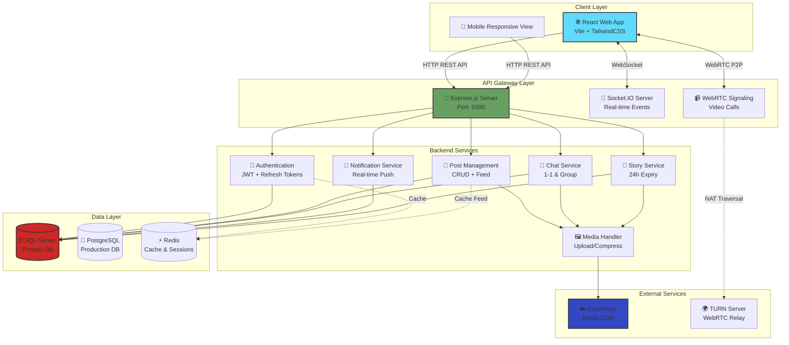

# 🌐 HVTSocial - Modern Social Media Platform

[](https://hvt-social.vercel.app)
[](https://github.com/HoTra171/HVTSocial)
[](https://nodejs.org/)
[](https://reactjs.org/)
[](LICENSE)

A production-ready social media application featuring real-time interaction, rich media sharing, and a responsive mobile-first design. Built for scalability and performance.

> 🎓 **Capstone Project** | Full-stack Developer | 2 months development cycle

---

## 📸 Feature Showcase

| **Main Feed** | **Chat Interface** | **User Profile** |
|:---:|:---:|:---:|
|  |  |  |
| *Infinite scrolling news feed with rich media support* | *Real-time messaging with typing indicators* | *Customizable profiles and media grid* |

| **Notifications** | **Create Post** | **Comments** |
|:---:|:---:|:---:|
|  |  |  |
| *Instantly notified of likes and friend requests* | *Easy post creation with media uploads* | *Nested comments and interactive discussions* |

---

## 🏗️ System Architecture

### High-Level Architecture Diagram



### Data Flow Examples

#### 1️⃣ **User Posts a Photo**
```
User → [Upload Image] → MediaService → Cloudinary
     ↓
PostService → [Save to DB] → MSSQL
     ↓
Socket.IO → [Broadcast] → Followers' Feeds
```

#### 2️⃣ **Real-time Chat Message**
```
User A → Socket.IO → ChatService → MSSQL
                   ↓
              User B (Online) ← Socket.IO emit
```

#### 3️⃣ **Video Call Initiation**
```
User A → [Offer SDP] → WebRTC Signaling (Socket.IO) → User B
       ← [Answer SDP] ←
       ↓
    P2P Connection Established (TURN if needed)
```

---

## 🛠️ Technology Stack

**Frontend**
- **Framework**: React 18 + Vite
- **Styling**: TailwindCSS + Lucide Icons
- **State/API**: Axios, React Router DOM
- **Realtime**: Socket.io-client

**Backend**
- **Runtime**: Node.js + Express
- **Database**: MSSQL (Dev) / PostgreSQL (Prod) with connection pooling
- **Realtime**: Socket.io (Namespaces, Rooms)
- **Security**: Helmet, Rate Limit, CORS, JWT (Access + Refresh)

**DevOps & Tools**
- **CI/CD**: GitHub Actions (Lint + Test)
- **Logging**: Winston (Daily Rotate) + Morgan
- **APIs**: Cloudinary (Media), Voicon (TTS - Integrated)

---

## ✨ Core Features

### 🔐 **Authentication & Authorization**
- JWT-based auth with access + refresh tokens
- Secure password hashing (bcrypt)
- Session management & token rotation
- Role-based access control

### 📝 **Post Management**
- Create, edit, delete posts with rich media
- Support for text, images, videos
- Privacy controls: Public / Friends / Private
- Infinite scroll feed with cursor pagination
- Like/unlike with real-time count updates
- Nested comments with threaded replies

### 💬 **Real-time Chat**
- 1-on-1 and group messaging
- Text, images, voice messages
- Typing indicators
- Online/offline status
- Read receipts
- Message recall (delete for everyone)
- Emoji reactions

### 🔔 **Notifications**
- Real-time push notifications via Socket.IO
- Like, comment, friend request alerts
- Smart badge counting
- Mark as read/unread
- Notification history

### 📸 **Stories**
- 24-hour ephemeral content
- Image/video stories
- View count & viewer list
- Story progress indicators
- Auto-delete after expiry

### 👥 **Social Features**
- Friend requests (send, accept, reject)
- Friends list & suggestions
- User discovery/search
- Profile customization (avatar, cover, bio)
- Follow/unfollow functionality

### 📹 **Video Calling**
- WebRTC-based 1-on-1 video calls
- Voice-only mode
- Call controls (mute, camera toggle)
- TURN server for NAT traversal
- Call signaling via Socket.IO

### 🔍 **Search & Discovery**
- Full-text search for posts
- User search by name/username
- Filter by friends/non-friends
- Suggested friends algorithm

### 🎨 **UI/UX**
- Fully responsive (mobile-first)
- Dark/light mode support
- Smooth animations & transitions
- Loading states & skeletons
- Error boundaries & fallbacks
- PWA-ready

---

## 📖 API Documentation

The API is fully documented and ready to import.

### **REST API Documentation**
*   **Swagger UI**: `http://localhost:5000/api-docs` (Local)
*   **JSON Spec**: `http://localhost:5000/api-docs.json`

### **Postman Collection**
*   **[Download Collection](./docs/HVTSocial.postman_collection.json)** - Import into Postman
*   Includes **50+ pre-configured requests**
*   Auto-saves JWT tokens after login
*   Environment variables for easy testing

**Quick Start with Postman:**
1. Import `docs/HVTSocial.postman_collection.json`
2. Set environment variable `baseUrl` to your backend URL
3. Run "Login" request → tokens auto-saved
4. Test other endpoints with auth

---

## 🛡️ Security Features

This project implements industry-standard security practices to protect user data and prevent common vulnerabilities.

### 1️⃣ **Authentication & Session Management**
```javascript
✅ JWT with HS256/RS256 signing
✅ Access Token (15min) + Refresh Token (7 days)
✅ Token rotation on refresh
✅ Secure password hashing (bcrypt, salt rounds: 10)
✅ HTTP-only cookies for refresh tokens (XSS protection)
✅ Token blacklist for logout invalidation
```

**Implementation:**
- Access tokens stored in memory (React state)
- Refresh tokens in HTTP-only cookies
- Auto-refresh on 401 responses

---

### 2️⃣ **Rate Limiting**
**Express Rate Limit** middleware protects against brute force and DDoS:

| Endpoint Type | Limit | Window | Protection Against |
|---------------|-------|--------|---------------------|
| **Auth** (`/login`, `/register`) | 10 requests | 15 minutes | Brute force attacks |
| **API** (General) | 100 requests | 15 minutes | API abuse |
| **Upload** (`/upload`) | 20 requests | 1 hour | Resource exhaustion |

**Example:**
```javascript
// Backend/middlewares/rateLimiter.js
const authLimiter = rateLimit({
  windowMs: 15 * 60 * 1000, // 15 minutes
  max: 10,
  message: 'Too many login attempts, please try again later'
});
```

---

### 3️⃣ **Secure HTTP Headers (Helmet)**
**Helmet.js** sets security headers automatically:

```http
✅ X-Content-Type-Options: nosniff
✅ X-Frame-Options: DENY (prevents clickjacking)
✅ X-XSS-Protection: 1; mode=block
✅ Strict-Transport-Security: max-age=31536000
✅ Content-Security-Policy: default-src 'self'
```

**Prevents:**
- Cross-Site Scripting (XSS)
- Clickjacking
- MIME-type sniffing attacks

---

### 4️⃣ **CORS Policy**
**Cross-Origin Resource Sharing** configured for trusted domains only:

```javascript
// Backend/config/cors.js
const allowedOrigins = [
  'https://hvt-social.vercel.app',
  'http://localhost:5173', // Dev frontend
];

app.use(cors({
  origin: (origin, callback) => {
    if (!origin || allowedOrigins.includes(origin)) {
      callback(null, true);
    } else {
      callback(new Error('Not allowed by CORS'));
    }
  },
  credentials: true // Allow cookies
}));
```

---

### 5️⃣ **Input Validation & Sanitization**
**Express Validator** validates all user inputs:

```javascript
✅ Email format validation
✅ Password strength requirements (8+ chars, alphanumeric)
✅ SQL injection prevention (parameterized queries)
✅ XSS prevention (HTML escaping)
✅ NoSQL injection prevention
```

**Example:**
```javascript
// Backend/validators/authValidator.js
body('email').isEmail().normalizeEmail(),
body('password').isLength({ min: 8 }).trim().escape()
```

---

### 6️⃣ **File Upload Security**
**Multer + Cloudinary** with strict validation:

| Restriction | Limit | Enforcement |
|-------------|-------|-------------|
| **File Size** | Images: 10MB, Videos: 50MB | Multer config |
| **File Types** | `.jpg`, `.png`, `.gif`, `.mp4`, `.webm` | MIME type check |
| **Upload Rate** | 20 uploads/hour | Rate limiter |
| **Malware Scan** | VirusTotal API (optional) | Post-upload check |

**Implementation:**
```javascript
// Backend/middlewares/upload.js
const upload = multer({
  limits: { fileSize: 10 * 1024 * 1024 }, // 10MB
  fileFilter: (req, file, cb) => {
    const allowedTypes = ['image/jpeg', 'image/png', 'image/gif'];
    if (allowedTypes.includes(file.mimetype)) {
      cb(null, true);
    } else {
      cb(new Error('Invalid file type'));
    }
  }
});
```

---

### 7️⃣ **Database Security**
```javascript
✅ Prepared statements (SQL injection prevention)
✅ Connection pooling with TLS/SSL
✅ Encrypted backups
✅ Row-level security policies
✅ Audit logging for sensitive operations
```

**Example (Parameterized Query):**
```javascript
// SAFE ✅
db.query('SELECT * FROM users WHERE id = ?', [userId]);

// UNSAFE ❌
db.query(`SELECT * FROM users WHERE id = ${userId}`);
```

---

### 8️⃣ **Error Handling**
**Never expose sensitive info in error messages:**

```javascript
// Production Error Response ✅
{
  "success": false,
  "message": "An error occurred"
}

// NOT: ❌
{
  "error": "SQL syntax error near 'SELECT * FROM users WHERE password=...'",
  "stack": "Error: at /home/user/backend/controllers/..."
}
```

**Implementation:**
```javascript
// Backend/middlewares/errorHandler.js
if (process.env.NODE_ENV === 'production') {
  res.status(500).json({ message: 'Server error' });
} else {
  res.status(500).json({ message: err.message, stack: err.stack });
}
```

---

### 9️⃣ **Environment Variables**
**Never commit secrets to Git:**

```bash
# .env (NOT committed to repo)
JWT_SECRET=your-256-bit-secret
DB_PASSWORD=secure-password
CLOUDINARY_API_SECRET=cloudinary-secret
```

**Security Checklist:**
- ✅ `.env` in `.gitignore`
- ✅ Use `.env.example` for documentation
- ✅ Rotate secrets regularly
- ✅ Use secret management tools (AWS Secrets Manager, Vault)

---

### 🔟 **Additional Best Practices**
```javascript
✅ HTTPS-only in production (SSL/TLS certificates)
✅ Regular dependency updates (npm audit fix)
✅ Logging & monitoring (Winston, Sentry)
✅ Principle of least privilege (user permissions)
✅ Security headers testing (securityheaders.com)
```

---

### 🛡️ **Security Testing**
Run these commands to audit security:

```bash
# Check for vulnerabilities
npm audit

# Fix auto-fixable issues
npm audit fix

# Check outdated packages
npm outdated

# Scan with Snyk
npx snyk test
```

---

### 📚 **Resources**
- [OWASP Top 10](https://owasp.org/www-project-top-ten/)
- [Node.js Security Best Practices](https://nodejs.org/en/docs/guides/security/)
- [JWT Best Practices](https://tools.ietf.org/html/rfc8725)

---

## 🚀 Getting Started

### 1. Prerequisites
- Node.js v18+
- SQL Server or PostgreSQL
- Git

### 2. Backend Setup
```bash
cd Backend
npm install
cp .env.example .env
# Fill in your Database, JWT, and Cloudinary secrets in .env
npm run migrate # Run DB migrations
npm start
```

### 3. Frontend Setup
```bash
cd Frontend
npm install
cp .env.example .env
npm run dev
```

---

## 🤝 Contributing
1.  Fork the repo
2.  Create your feature branch (`git checkout -b feature/AmazingFeature`)
3.  Commit your changes (`git commit -m 'Add some AmazingFeature'`)
4.  Push to the branch (`git push origin feature/AmazingFeature`)
5.  Open a Pull Request

---

© 2025 HVTSocial. Built with ❤️.
