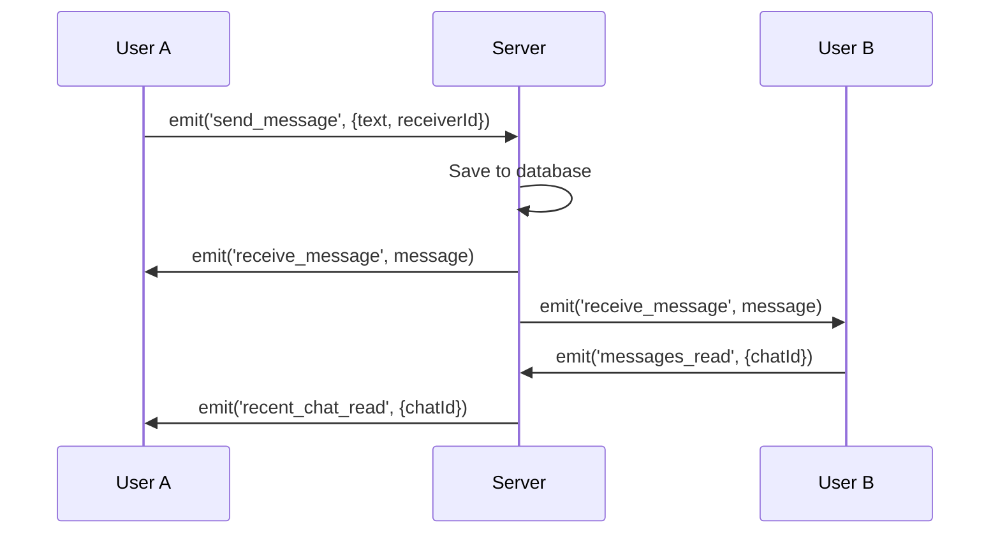
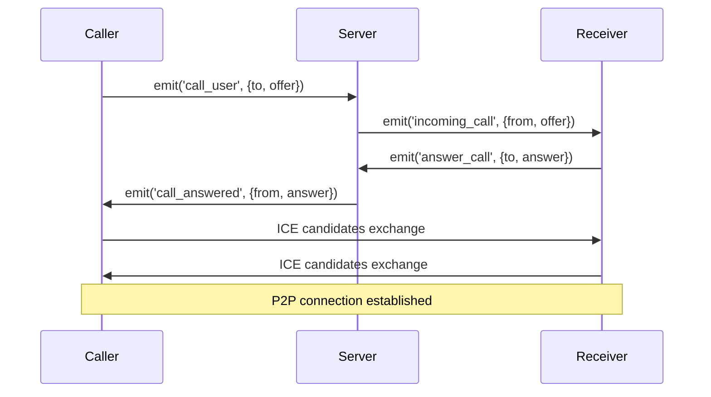

# 🔌 Socket.IO Events Reference

Complete documentation of WebSocket events used in HVTSocial.

---

## 📡 Connection & Registration

### `connection`
**Direction:** Server → Client (automatic)
**Trigger:** Client connects to Socket.IO server
**Payload:** None

```javascript
// Client-side
socket.on('connect', () => {
  console.log('Connected:', socket.id);
});
```

---

### `register_user`
**Direction:** Client → Server
**Purpose:** Register user ID with socket connection
**Payload:**
```javascript
{
  userId: Number // User ID from database
}
```

**Example:**
```javascript
// Frontend
socket.emit('register_user', { userId: 123 });
```

**Server Response:** None (silent registration)

---

### `disconnect`
**Direction:** Server → Client (automatic)
**Trigger:** Connection lost
**Payload:** Reason string

```javascript
socket.on('disconnect', (reason) => {
  console.log('Disconnected:', reason);
  // Reasons: 'transport close', 'client namespace disconnect', etc.
});
```

---

## 💬 Chat Events

### `send_message`
**Direction:** Client → Server
**Purpose:** Send a chat message
**Payload:**
```javascript
{
  chatId: Number,
  text: String,
  receiverId: Number,
  type: String, // 'text' | 'image' | 'voice'
  mediaUrl?: String // Optional, for images/voice
}
```

**Example:**
```javascript
socket.emit('send_message', {
  chatId: 1,
  text: 'Hello!',
  receiverId: 456,
  type: 'text'
});
```

---

### `receive_message`
**Direction:** Server → Client
**Purpose:** Receive new message
**Payload:**
```javascript
{
  id: Number,
  chat_id: Number,
  sender_id: Number,
  text: String,
  type: String,
  media_url?: String,
  created_at: String (ISO 8601),
  sender: {
    id: Number,
    full_name: String,
    avatar: String
  }
}
```

**Example:**
```javascript
socket.on('receive_message', (message) => {
  console.log('New message:', message);
  // Update UI with new message
});
```

---

### `typing`
**Direction:** Client → Server
**Purpose:** Notify that user is typing
**Payload:**
```javascript
{
  chatId: Number,
  userId: Number,
  isTyping: Boolean
}
```

**Example:**
```javascript
// Start typing
socket.emit('typing', { chatId: 1, userId: 123, isTyping: true });

// Stop typing
socket.emit('typing', { chatId: 1, userId: 123, isTyping: false });
```

---

### `user_typing`
**Direction:** Server → Client
**Purpose:** Partner is typing indicator
**Payload:**
```javascript
{
  chatId: Number,
  userId: Number,
  isTyping: Boolean,
  userName: String
}
```

**Example:**
```javascript
socket.on('user_typing', (data) => {
  if (data.isTyping) {
    showTypingIndicator(data.userName);
  } else {
    hideTypingIndicator();
  }
});
```

---

### `messages_read`
**Direction:** Client → Server
**Purpose:** Mark messages as read
**Payload:**
```javascript
{
  chatId: Number,
  userId: Number
}
```

**Example:**
```javascript
socket.emit('messages_read', { chatId: 1, userId: 123 });
```

---

### `recent_chat_read`
**Direction:** Server → Client
**Purpose:** Chat was marked as read by other user
**Payload:**
```javascript
{
  chatId: Number
}
```

**Example:**
```javascript
socket.on('recent_chat_read', (data) => {
  // Update read receipts in UI
  updateChatReadStatus(data.chatId);
});
```

---

### `recall_message`
**Direction:** Client → Server
**Purpose:** Delete message for everyone
**Payload:**
```javascript
{
  messageId: Number,
  chatId: Number
}
```

**Example:**
```javascript
socket.emit('recall_message', { messageId: 123, chatId: 1 });
```

---

### `message_recalled`
**Direction:** Server → Client
**Purpose:** Message was recalled
**Payload:**
```javascript
{
  messageId: Number,
  chatId: Number
}
```

**Example:**
```javascript
socket.on('message_recalled', (data) => {
  // Remove message from UI or show "Message recalled"
  removeMessage(data.messageId);
});
```

---

## 🔔 Notification Events

### `new_notification`
**Direction:** Server → Client
**Purpose:** Push new notification to user
**Payload:**
```javascript
{
  id: Number,
  type: String, // 'like' | 'comment' | 'friend_request' | 'message'
  content: String,
  actor: {
    id: Number,
    full_name: String,
    avatar: String
  },
  created_at: String (ISO 8601),
  is_read: Boolean,
  link?: String // Optional, URL to related content
}
```

**Example:**
```javascript
socket.on('new_notification', (notification) => {
  // Show toast notification
  showToast(notification.content);

  // Update notification badge
  incrementNotificationCount();

  // Add to notification list
  addNotification(notification);
});
```

---

### `unread_count`
**Direction:** Server → Client
**Purpose:** Update unread notification count
**Payload:**
```javascript
{
  count: Number
}
```

**Example:**
```javascript
socket.on('unread_count', (data) => {
  updateNotificationBadge(data.count);
});
```

---

### `notification_read`
**Direction:** Client → Server
**Purpose:** Mark notification as read
**Payload:**
```javascript
{
  notificationId: Number
}
```

**Example:**
```javascript
socket.emit('notification_read', { notificationId: 123 });
```

---

## 👥 User Status Events

### `user_online`
**Direction:** Server → Broadcast
**Purpose:** User came online
**Payload:**
```javascript
{
  userId: Number
}
```

**Example:**
```javascript
socket.on('user_online', (data) => {
  updateUserStatus(data.userId, 'online');
});
```

---

### `user_offline`
**Direction:** Server → Broadcast
**Purpose:** User went offline
**Payload:**
```javascript
{
  userId: Number,
  lastSeen: String (ISO 8601)
}
```

**Example:**
```javascript
socket.on('user_offline', (data) => {
  updateUserStatus(data.userId, 'offline', data.lastSeen);
});
```

---

## 📞 Video Call Events (WebRTC Signaling)

### `call_user`
**Direction:** Client → Server
**Purpose:** Initiate call to another user
**Payload:**
```javascript
{
  to: Number, // Receiver user ID
  offer: RTCSessionDescription,
  isVideo: Boolean,
  callerName: String,
  callerAvatar: String,
  chatId: Number
}
```

**Example:**
```javascript
const offer = await peerConnection.createOffer();
socket.emit('call_user', {
  to: 456,
  offer,
  isVideo: true,
  callerName: 'John Doe',
  callerAvatar: 'https://...',
  chatId: 1
});
```

---

### `incoming_call`
**Direction:** Server → Client
**Purpose:** Receive incoming call
**Payload:**
```javascript
{
  from: Number,
  offer: RTCSessionDescription,
  isVideo: Boolean,
  callerName: String,
  callerAvatar: String,
  chatId: Number
}
```

**Example:**
```javascript
socket.on('incoming_call', async (data) => {
  // Show incoming call UI
  showIncomingCallModal(data);

  // Set remote description
  await peerConnection.setRemoteDescription(data.offer);
});
```

---

### `answer_call`
**Direction:** Client → Server
**Purpose:** Accept call and send answer
**Payload:**
```javascript
{
  to: Number,
  answer: RTCSessionDescription
}
```

**Example:**
```javascript
const answer = await peerConnection.createAnswer();
socket.emit('answer_call', {
  to: 123,
  answer
});
```

---

### `call_answered`
**Direction:** Server → Client
**Purpose:** Call was accepted
**Payload:**
```javascript
{
  from: Number,
  answer: RTCSessionDescription
}
```

**Example:**
```javascript
socket.on('call_answered', async (data) => {
  await peerConnection.setRemoteDescription(data.answer);
  console.log('Call connected!');
});
```

---

### `ice_candidate`
**Direction:** Bidirectional
**Purpose:** Exchange ICE candidates for NAT traversal
**Payload:**
```javascript
{
  to: Number,
  candidate: RTCIceCandidate
}
```

**Example:**
```javascript
// Send ICE candidate
peerConnection.onicecandidate = (event) => {
  if (event.candidate) {
    socket.emit('ice_candidate', {
      to: receiverId,
      candidate: event.candidate
    });
  }
};

// Receive ICE candidate
socket.on('ice_candidate', async (data) => {
  await peerConnection.addIceCandidate(data.candidate);
});
```

---

### `end_call`
**Direction:** Bidirectional
**Purpose:** Terminate call
**Payload:**
```javascript
{
  to: Number
}
```

**Example:**
```javascript
// End call
socket.emit('end_call', { to: 456 });

// Call ended by other user
socket.on('call_ended', () => {
  closeCall();
  peerConnection.close();
});
```

---

## 📸 Story Events

### `story_created`
**Direction:** Server → Broadcast
**Purpose:** New story posted
**Payload:**
```javascript
{
  storyId: Number,
  userId: Number,
  userName: String,
  userAvatar: String,
  mediaUrl: String,
  mediaType: String, // 'image' | 'video'
  createdAt: String (ISO 8601)
}
```

**Example:**
```javascript
socket.on('story_created', (story) => {
  addStoryToFeed(story);
  showNotification(`${story.userName} posted a new story`);
});
```

---

### `story_viewed`
**Direction:** Client → Server
**Purpose:** Mark story as viewed
**Payload:**
```javascript
{
  storyId: Number,
  viewerId: Number
}
```

**Example:**
```javascript
socket.emit('story_viewed', { storyId: 123, viewerId: 456 });
```

---

## 👥 Friend Request Events

### `friend_request_sent`
**Direction:** Server → Client
**Purpose:** Notify user of new friend request
**Payload:**
```javascript
{
  requestId: Number,
  from: {
    id: Number,
    full_name: String,
    avatar: String
  }
}
```

**Example:**
```javascript
socket.on('friend_request_sent', (data) => {
  showNotification(`${data.from.full_name} sent you a friend request`);
  updateFriendRequestCount(+1);
});
```

---

### `friend_request_accepted`
**Direction:** Server → Client
**Purpose:** Friend request was accepted
**Payload:**
```javascript
{
  friendId: Number,
  friend: {
    id: Number,
    full_name: String,
    avatar: String
  }
}
```

**Example:**
```javascript
socket.on('friend_request_accepted', (data) => {
  showNotification(`${data.friend.full_name} accepted your friend request`);
  addToFriendsList(data.friend);
});
```

---

### `friend_request_updated`
**Direction:** Server → Client
**Purpose:** Friend request status changed
**Payload:**
```javascript
{
  action: String, // 'accepted' | 'rejected' | 'cancelled'
  friendId: Number
}
```

**Example:**
```javascript
socket.on('friend_request_updated', (data) => {
  if (data.action === 'accepted') {
    // Update UI
  } else if (data.action === 'rejected') {
    // Remove from pending list
  }
});
```

---

## ❤️ Post Interaction Events

### `post_liked`
**Direction:** Server → Broadcast
**Purpose:** Post received a like
**Payload:**
```javascript
{
  postId: Number,
  userId: Number,
  userName: String,
  likeCount: Number
}
```

**Example:**
```javascript
socket.on('post_liked', (data) => {
  updatePostLikeCount(data.postId, data.likeCount);

  // If it's my post, show notification
  if (isMyPost(data.postId)) {
    showNotification(`${data.userName} liked your post`);
  }
});
```

---

### `post_commented`
**Direction:** Server → Broadcast
**Purpose:** New comment on post
**Payload:**
```javascript
{
  postId: Number,
  comment: {
    id: Number,
    user: {
      id: Number,
      full_name: String,
      avatar: String
    },
    content: String,
    created_at: String (ISO 8601)
  },
  commentCount: Number
}
```

**Example:**
```javascript
socket.on('post_commented', (data) => {
  addCommentToPost(data.postId, data.comment);
  updateCommentCount(data.postId, data.commentCount);
});
```

---

## 🔧 Connection Management

### Error Handling

```javascript
socket.on('connect_error', (error) => {
  console.error('Connection failed:', error);
  showReconnectingMessage();
});

socket.on('reconnect', (attemptNumber) => {
  console.log('Reconnected after', attemptNumber, 'attempts');
  hideReconnectingMessage();
});

socket.on('reconnect_failed', () => {
  console.error('Failed to reconnect');
  showOfflineMessage();
});
```

---

### Heartbeat / Ping-Pong

Socket.IO handles this automatically, but you can listen:

```javascript
socket.on('ping', () => {
  console.log('Ping received');
});

socket.on('pong', (latency) => {
  console.log('Latency:', latency, 'ms');
});
```

---

## 📊 Event Flow Examples

### Example 1: Sending a Chat Message



---

### Example 2: Video Call Flow



---

## 🛠️ Implementation Tips

### 1. Namespace Organization

```javascript
// Backend
const io = require('socket.io')(server);

const chatNamespace = io.of('/chat');
const notificationNamespace = io.of('/notifications');

chatNamespace.on('connection', (socket) => {
  // Handle chat events
});

notificationNamespace.on('connection', (socket) => {
  // Handle notification events
});
```

---

### 2. Room-based Broadcasting

```javascript
// Join room for specific chat
socket.join(`chat_${chatId}`);

// Broadcast to room
io.to(`chat_${chatId}`).emit('receive_message', message);
```

---

### 3. Authentication

```javascript
// Frontend
const socket = io('http://localhost:5000', {
  auth: {
    token: localStorage.getItem('token')
  }
});

// Backend
io.use((socket, next) => {
  const token = socket.handshake.auth.token;
  if (isValidToken(token)) {
    next();
  } else {
    next(new Error('Authentication error'));
  }
});
```

---

## 📚 Resources

- [Socket.IO Docs](https://socket.io/docs/v4/)
- [WebRTC API](https://developer.mozilla.org/en-US/docs/Web/API/WebRTC_API)
- [HVTSocial Backend Code](../Backend/sockets/)

---

**Last Updated:** January 2026
